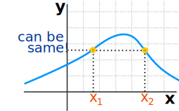

# Functions
## Injective, Surjective and Bijective
A function is a way of matching the members of a set "A" **to** a set "B":

- A ***General Function*** points from each member of "A" to a member of "B".

    It ***never*** has one "A" pointing to more than one "B", so ***one-to-many*** is not OK in a function (so something like "f(x) = 7 ***or*** 9" is not allowed)

    But more than one "A" can point to the same "B" (***many-to-one is OK***)

- ***Injective*** means we won't have two or more "A"s pointing to the same "B".

    So ***many-to-one is NOT OK*** (which is OK for a general function).

    As it is also a function ***one-to-many is not OK***

    But we can have a "B" without a matching "A"

    Injective is also called "***One-to-One***"

- ***Surjective*** means that every "B" has ***at least one*** matching "A" (maybe more than one).

    There won't be a "B" left out.

- ***Bijective*** means both Injective and Surjective together.

    So there is a perfect "***one-to-one correspondence***" between the members of the sets.

    (But don't get that confused with the term "One-to-One" used to mean injective).
::: warning
Bijective functions have an <b><i>inverse</i></b> !

If every "A" goes to a unique "B", and every "B" has a matching "A" then we can go back and forwards without being led astray.
:::
## On A Graph
So let us see a few examples to understand what is going on.

When ***A*** and ***B*** are subsets of the Real Numbers we can graph the relationship.

Let us have ***A*** on the x axis and ***B*** on y, and look at our first example:

This is ***not a function*** because we have an ***A*** with many ***B***. It is like saying f(x) = 2 ***or*** 4

It fails the "Vertical Line Test" and so is not a function. But is still a valid relationship, so don't get angry with it.

Now, a general function can be like this:

*A General Function*

It CAN (possibly) have a ***B*** with many ***A***. For example sine, cosine, etc are like that. Perfectly valid functions.

But an "***Injective Function***" is stricter, and looks like this:

*"Injective" (one-to-one)*

In fact we can do a "Horizontal Line Test":

::: warning
To be <i><b>Injective</b></i>, a Horizontal Line should never intersect the curve at 2 or more points.
:::

So:

  - If it passes the vertical line test it is a function
  - If it also passes the horizontal line test it is an injective function
